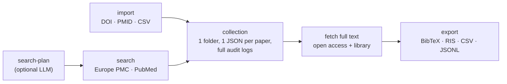

# paper-extract

**Auditable literature collections for biomedical LLM/RAG workflows.**

[](LICENSE)
[](pyproject.toml)
[](tests/)
[](skill/paper-extract/SKILL.md)

**English** · [中文](README.zh-CN.md)

Turn a PubMed / Europe PMC query, a DOI list, a PMID list, or a CSV into a
**local, reproducible paper collection**: metadata, structured full-text JSON,
optional PDFs, citation exports, and command logs. Unlike a plain PDF parser,
`paper-extract` keeps the whole literature workflow auditable — so the result
is a dataset you can hand to an LLM/RAG pipeline, a systematic review, or a
grant background, and still trace every paper back to how it got there.

- **One collection = one local folder**
- **One paper = one readable `article.json`** (metadata + structured full text)
- **Every command = one `logs/*.json` audit trail**
- **Exports = BibTeX / RIS / CSV / JSONL** (JSONL is RAG-ready)
- **Full text = open access first**, optionally *your own* institutional access
- **Agent-ready** — includes a Skill for Claude Code / Codex-style agents



## What you get

One query in, one auditable folder out. This is a **real run** (search →
fetch open-access full text → status → export), not a mock-up:

```console
$ paper-extract search --collection pptp-demo \
    --query 'pediatric preclinical testing program AND "drug response"' --max 8
Europe PMC : 7
PubMed     : 6
overlap    : 0
→ 13 articles added

$ paper-extract fetch --collection pptp-demo --output-format json --access open
Fetching: 13 to fetch, 0 already done (skipped)  [output-format=json, access=open]
  ...
Done. ok=7 fail=6 / 13 attempted (0 already done).

$ paper-extract status --collection pptp-demo
Collection: pptp-demo
Articles: 13
Metadata available: 13
Fulltext available: 7
PDF available: 0
Article kinds: {'research': 9, 'review': 3, 'other': 1}
Quality: {'unknown': 6, 'pass': 6, 'weak': 1}
Sources: {'fulltext:pmc_xml': 7}
Failed/incomplete articles: 6

$ paper-extract collection export --collection pptp-demo --to bib
Wrote export: pptp-demo.bib
```

The failures aren't hidden — 6 papers had no open-access full text, and that's
recorded per-article and in the fetch log. Point `--access library` at them
later to retrieve the rest through your own institutional login.

The collection is just plain files you can read, diff, and version:

```text
data/collections/pptp-demo/
├── collection.json                       # collection manifest
├── articles.csv                          # one-line-per-paper index
├── articles/
│   └── doi_10_3389_fonc_2026_1685447/
│       └── article.json                  # metadata + structured full text
└── logs/
    ├── search_20260706T061256Z.json      # audit trail: what was searched
    ├── fetch_20260706T061355Z.json       #             what full text was fetched
    └── status_20260706T061401Z.json      #             collection state over time
```

And each `article.json` is structured for downstream extraction (real fields,
body trimmed):

```jsonc
{
  "schema_version": "1.0",
  "article_id": "doi_10_3389_fonc_2026_1685447",
  "identifiers": { "doi": "10.3389/fonc.2026.1685447", "pmid": "41939480", "pmcid": "PMC13046488" },
  "metadata": {
    "title": "ELDA: real-time functional drug profiling in acute lymphoblastic leukemia.",
    "authors": ["Mariano SS", "Assis LHP", "Correa JR", "..."],
    "journal": "Frontiers in oncology",
    "pub_year": 2026,
    "article_kind": "research",
    "is_open_access": true
  },
  "links": {
    "pmc": { "pdf": "https://www.ncbi.nlm.nih.gov/pmc/articles/PMC13046488/pdf/" },
    "publisher": { "page": "https://doi.org/10.3389/fonc.2026.1685447" }
  },
  "sections": { "abstract": "…", "Introduction": "…", "Results": "…", "Discussion": "…" },
  "status": { "metadata": "found", "fulltext": "available", "pdf": "not_started", "llm_extract": "not_started" },
  "source": { "metadata": ["epmc"], "fulltext": "pmc_xml" },
  "quality": { "status": "pass", "body_chars": 50773, "section_count": 12, "issues": [] },
  "updated_at": "2026-07-06T06:13:53Z"
}
```

## Who it's for

**Ideal for:**

- Bioinformatics / medical researchers batch-collecting the literature on a topic.
- Systematic reviews, rebuttals, grant backgrounds — anyone who needs a
  **traceable, reproducible** set of papers.
- LLM/RAG builders who need **structured full-text JSON**, not a pile of loose PDFs.
- Researchers with legitimate **institutional library access** who want their
  own accessible full text organized into a local corpus.

**Not for:**

- Bypassing paywalls or authentication.
- Auto-solving captchas.
- Mass-downloading publisher content.
- Being a general-purpose scanned-PDF OCR tool.

`paper-extract` only ever uses **your own valid credentials**, stores none of
them, and asks you to respect publisher terms — see [Responsible use](#responsible-use).

## Why paper-extract

**A. Reproducible literature collections.** One paper = one `article.json`, one
collection = one folder, every command = a `logs/*.json` entry. You can read,
diff, version, and audit the whole thing with ordinary tools.

**B. Full text first, not just metadata.** Many tools stop at citations.
`paper-extract` fetches structured full-text JSON (and optional PDFs), with a
per-article quality check (`body_chars`, `section_count`, issues) so you know
what you actually got.

**C. Open access *and* your own library access.** Open access is automatic. For
subscription content it drives a real browser through your institution's login
(log in once, batch many) and **never stores your credentials**; proxy/token
links are flagged `sensitive` and stripped from every export.

**D. Built for downstream LLM/RAG extraction.** The point isn't "download
papers" — it's turning literature into a collection an LLM can reliably process.
JSONL export is RAG-ready.

**E. Agent skill included.** Ships with a [Skill](skill/paper-extract/SKILL.md)
that teaches AI coding agents (Claude Code, Codex, …) to drive the whole
pipeline from plain language.

## Install

### Users

```bash
pip install "paper-extract[browser,pdf,llm] @ git+https://github.com/hfl112/paper-extract.git"
paper-extract --help
```

(Drop the `[browser,pdf,llm]` extras for a core-only install — search, open-access
full text, and exports work without them.) PyPI release is planned.

### Developers

```bash
git clone https://github.com/hfl112/paper-extract.git
cd paper-extract
uv venv --python 3.11                 # creates .venv (downloads Python if needed)
source .venv/bin/activate             # IMPORTANT: activate first — with a conda env
                                      # active, `uv pip` would install into conda, not .venv
uv pip install ".[browser,pdf,llm,dev]"
paper-extract --help
```

Then copy `.env.example` to `.env` and fill in what you use (all optional; see
[Configuration](#configuration)).

## Quick start

```bash
# 1. gather papers (Europe PMC + PubMed)
paper-extract search --collection demo --query 'pediatric preclinical testing program AND "drug response"' --max 20
#    author search:   --query 'AUTH:"Houghton PJ" AND AUTH:"Smith MA"'
#    by identifiers:  paper-extract collection import --collection demo --input-doi 10.1002/pbc.21508

# 2. fetch full text (open access)
paper-extract fetch --collection demo --output-format json --access open

# 3. review & export
paper-extract status --collection demo
paper-extract collection export --collection demo --to bib   # bib | ris | csv | jsonl
```

## Institutional / library full text

For paywalled papers, `paper-extract` reuses your university access through a
real browser ([cloakbrowser](https://pypi.org/project/cloakbrowser/)). Set up
once, then batch-fetch:

```bash
paper-extract library login --libkey     # LibKey Nomad users (macOS + Chrome)
paper-extract library login              # "Access through your institution" (SSO)
paper-extract fetch --collection demo --output-format both --access library --speed normal
```

How it works:

- You log in **once** in the browser that opens; the session is reused for every
  article (entering via the EZProxy `login?url=` form, throttled to stay polite).
- The browser profile keeps a **stable fingerprint seed**, so a solved
  captcha/challenge cookie stays valid across login and fetch runs.
- If a captcha or login wall appears during an interactive fetch, solve it in
  the browser window — the tool polls the page and continues automatically.
- The proxy domain is **auto-detected from your session**; nothing is hardcoded
  to any school. Use `--speed normal`/`slow` if a publisher keeps challenging.

See [`skill/paper-extract/references/library-access.md`](skill/paper-extract/references/library-access.md)
for the full decision tree and troubleshooting.

## The Skill (for AI agents)

The Skill and the CLI are separate. Install both.

First install the CLI:

```bash
uv tool install "paper-extract[browser,pdf,llm] @ git+https://github.com/hfl112/paper-extract.git"
```

Then install the Skill:
```skillshare install hfl112/paper-extract/skill/paper-extract
skillshare sync
```

Then just ask in plain language:

> *"build a collection of papers on PPTP drug response, fetch open full text, export BibTeX"* ·
> *"import these 50 DOIs and build a local JSONL corpus"* ·
> *"use my library access for the papers that aren't open access"*

## Configuration

Copy `.env.example` → `.env` (all optional):

| Variable | Purpose |
|---|---|
| `PAPER_EXTRACT_EMAIL` | Unpaywall / NCBI politeness email |
| `NCBI_API_KEY` | faster PubMed / PMC |
| `SPRINGER_OA_API_KEY`, `ELSEVIER_API_KEY`, `WILEY_TDM_TOKEN`, `CORE_API_KEY` | publisher OA full text |
| `LLM_PROVIDER` + `GEMINI_API_KEY` / `OPENAI_API_KEY` / `DEEPSEEK_API_KEY` / `ANTHROPIC_API_KEY` | LLM search plans |

## What's in this repo

```text
paper_extract/   pyproject.toml   # the engine (CLI + library)
llmclient/                        # provider-agnostic LLM client (bundled)
skill/paper-extract/              # the agent Skill (SKILL.md + references)
tests/                            # offline unit + smoke tests (75 checks)
```

## Privacy & safety

- No credentials are stored; cookies/tokens never enter `article.json`.
- Proxy/login links are flagged `sensitive` and excluded from all exports.
- `data/`, `.env`, cookies, browser profiles, and extensions are gitignored and never packaged.

## Responsible use

Library/institutional access only works through **your own valid credentials** — the
tool never bypasses authentication. You are responsible for complying with your
institution's acceptable-use policy and each publisher's Terms of Service; many
prohibit bulk or automated downloading. Use the built-in throttle (`--speed normal`
or `slow`), keep batches reasonable, and stop if a publisher keeps challenging the
session.

## Tests

```bash
uv pip install ".[dev]"
bash tests/run_all.sh        # 28 unit tests + 5 smoke suites, all offline
```

## License

[MIT](LICENSE).
