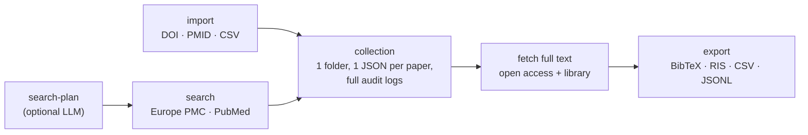

# paper-extract

[](LICENSE)
[](pyproject.toml)
[](tests/)
[](skill/paper-extract/SKILL.md)

**English** · [中文](README.zh-CN.md)

Search → collect → full text → export. Build **auditable, local collections of
biomedical papers**: metadata, structured full-text JSON, optional PDFs, run
logs, and citation exports (BibTeX / RIS / CSV / JSONL). Full text comes from
**open access _and_ your own institutional library access** (EZProxy / LibKey /
SSO) — a clean foundation for downstream LLM / RAG extraction.



## Why paper-extract

- **Auditable by design.** One folder per collection, one `article.json` per
  paper — everything is a plain file you can read, diff, and version. Every
  command leaves a `logs/*.json` trail.
- **Open + paywalled full text.** Open access is automatic. For subscription
  content it drives a real browser through *your* institution's login (log in
  once, batch many) and never stores your credentials.
- **Provider-agnostic LLM planning.** `search-plan --prompt` expands aliases and
  builds precise queries via Gemini / OpenAI / DeepSeek / Claude — or run fully
  deterministic with `--no-llm`.
- **Nothing hardcoded, nothing leaked.** Your institution's proxy domain is
  auto-detected from your login session; proxy/token links are flagged
  `sensitive` and stripped from every export.
- **Agent-ready.** Ships with a [Skill](skill/paper-extract/SKILL.md) that
  teaches AI coding agents (Claude Code, Codex, …) to drive the whole pipeline
  from plain language.

## Install

With [uv](https://github.com/astral-sh/uv) (recommended — no conda needed):

```bash
uv venv --python 3.11                 # creates .venv (downloads Python if needed)
source .venv/bin/activate             # IMPORTANT: activate first — with a conda env
                                      # active, `uv pip` would install into conda, not .venv
uv pip install ".[browser,pdf,llm]"   # engine + library access + PDF parsing + LLM SDKs
paper-extract --help
```

Minimal install (core only): `uv pip install .`

Then copy `.env.example` to `.env` and fill in what you use (all optional; see
[Configuration](#configuration)).

## Quick start

```bash
# 1. gather papers (Europe PMC + PubMed)
paper-extract search --collection demo --query 'cancer "whole genome doubling"' --max 20
#    author search:   --query 'AUTH:"Houghton PJ" AND AUTH:"Smith MA"'
#    by identifiers:  paper-extract collection import --collection demo --input-doi 10.1002/pbc.21508

# 2. fetch full text (open access)
paper-extract fetch --collection demo --output-format json --access open

# 3. review & export
paper-extract status --collection demo
paper-extract collection export --collection demo --to bib   # bib | ris | csv | jsonl
```

Each collection lives in `data/collections/<name>/`:

```text
data/collections/demo/
├── collection.json          # collection manifest
├── articles.csv             # one-line-per-paper index
├── articles/<id>/article.json   # metadata + structured full text, per paper
└── logs/*.json              # audit trail of every command
```

## Institutional / library full text

For paywalled papers, `paper-extract` reuses your university access through a
real browser ([cloakbrowser](https://pypi.org/project/cloakbrowser/)). Set up
once, then batch-fetch:

```bash
paper-extract library login --libkey     # LibKey Nomad users (macOS + Chrome)
paper-extract library login              # "Access through your institution" (SSO)
paper-extract fetch --collection demo --output-format both --access library --speed normal
```

How it works:

- You log in **once** in the browser that opens; the session is reused for every
  article (entering via the EZProxy `login?url=` form, throttled to stay polite).
- The browser profile keeps a **stable fingerprint seed**, so a solved
  captcha/challenge cookie stays valid across login and fetch runs.
- If a captcha or login wall appears during an interactive fetch, solve it in
  the browser window — the tool polls the page and continues automatically.
- The proxy domain is **auto-detected from your session**; nothing is hardcoded
  to any school. Use `--speed normal`/`slow` if a publisher keeps challenging.

See [`skill/paper-extract/references/library-access.md`](skill/paper-extract/references/library-access.md)
for the full decision tree and troubleshooting.

## The Skill (for AI agents)

[`skill/paper-extract/`](skill/paper-extract/) teaches an AI coding agent
(Claude Code, etc.) how and when to drive the CLI — including the interactive
library-login flow. Install with
[skillshare](https://github.com/runkids/skillshare) (copy `skill/paper-extract/`
into your skills dir, then `skillshare sync`) or point your agent's skills
directory at it. Then just ask in plain language:

> *"build a collection of papers on whole genome doubling"* ·
> *"fetch full text for these 30 DOIs, use my library for the paywalled ones"* ·
> *"export everything to BibTeX"*

## Configuration

Copy `.env.example` → `.env` (all optional):

| Variable | Purpose |
|---|---|
| `PAPER_EXTRACT_EMAIL` | Unpaywall / NCBI politeness email |
| `NCBI_API_KEY` | faster PubMed / PMC |
| `SPRINGER_OA_API_KEY`, `ELSEVIER_API_KEY`, `WILEY_TDM_TOKEN`, `CORE_API_KEY` | publisher OA full text |
| `LLM_PROVIDER` + `GEMINI_API_KEY` / `OPENAI_API_KEY` / `DEEPSEEK_API_KEY` / `ANTHROPIC_API_KEY` | LLM search plans |

## What's in this repo

```text
paper_extract/   pyproject.toml   # the engine (CLI + library)
llmclient/                        # provider-agnostic LLM client (bundled)
skill/paper-extract/              # the agent Skill (SKILL.md + references)
tests/                            # offline unit + smoke tests (75 checks)
```

## Privacy & safety

- No credentials are stored; cookies/tokens never enter `article.json`.
- Proxy/login links are flagged `sensitive` and excluded from all exports.
- `data/`, `.env`, cookies, browser profiles, and extensions are gitignored and never packaged.

## Responsible use

Library/institutional access only works through **your own valid credentials** — the
tool never bypasses authentication. You are responsible for complying with your
institution's acceptable-use policy and each publisher's Terms of Service; many
prohibit bulk or automated downloading. Use the built-in throttle (`--speed normal`
or `slow`), keep batches reasonable, and stop if a publisher keeps challenging the
session.

## Tests

```bash
uv pip install ".[dev]"
bash tests/run_all.sh        # 28 unit tests + 5 smoke suites, all offline
```

## License

[MIT](LICENSE).
