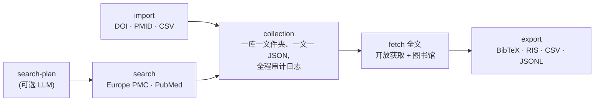

# paper-extract

[](LICENSE)
[](pyproject.toml)
[](tests/)
[](skill/paper-extract/SKILL.md)

[English](README.md) · **中文**

检索 → 收集 → 全文 → 导出。构建**可审计的本地生物医学文献收藏库**：元数据、
结构化全文 JSON、可选 PDF、运行日志，以及引文导出（BibTeX / RIS / CSV /
JSONL）。全文同时覆盖**开放获取 _和_ 你自己的机构图书馆访问**（EZProxy /
LibKey / SSO）——为下游 LLM / RAG 抽取打好干净的地基。



## 为什么用 paper-extract

- **天生可审计。** 一个收藏库一个文件夹、一篇文献一个 `article.json`——全部是
  可读、可 diff、可版本管理的普通文件。每条命令都留下 `logs/*.json` 记录。
- **开放获取 + 付费墙全文。** 开放获取全自动；订阅内容通过真实浏览器走*你自己*
  机构的登录（登录一次、批量多篇），绝不保存你的账号密码。
- **不绑定 LLM 供应商。** `search-plan --prompt` 可用 Gemini / OpenAI /
  DeepSeek / Claude 扩展别名、生成精确检索式——也可以 `--no-llm` 完全确定性运行。
- **零硬编码、零泄漏。** 机构代理域名从你的登录会话自动识别；带代理/令牌的链接
  一律标记 `sensitive` 并从所有导出中剔除。
- **Agent 即插即用。** 内置 [Skill](skill/paper-extract/SKILL.md)，教会 AI 编程
  助手（Claude Code、Codex 等）用自然语言驱动整条流水线。

## 安装

推荐用 [uv](https://github.com/astral-sh/uv)（无需 conda）：

```bash
uv venv --python 3.11                 # 创建 .venv(需要时自动下载 Python)
source .venv/bin/activate             # 重要:先激活!若终端里有激活的 conda 环境,
                                      # 不激活直接 uv pip install 会装进 conda 而不是 .venv
uv pip install ".[browser,pdf,llm]"   # 引擎 + 图书馆访问 + PDF 解析 + LLM SDK
paper-extract --help
```

最小安装（仅核心）：`uv pip install .`

然后把 `.env.example` 复制为 `.env`，按需填写（全部可选，见[配置](#配置)）。

## 快速上手

```bash
# 1. 收集文献(Europe PMC + PubMed)
paper-extract search --collection demo --query 'cancer "whole genome doubling"' --max 20
#    按作者检索:   --query 'AUTH:"Houghton PJ" AND AUTH:"Smith MA"'
#    按标识符导入: paper-extract collection import --collection demo --input-doi 10.1002/pbc.21508

# 2. 抓取全文(开放获取)
paper-extract fetch --collection demo --output-format json --access open

# 3. 查看与导出
paper-extract status --collection demo
paper-extract collection export --collection demo --to bib   # bib | ris | csv | jsonl
```

每个收藏库位于 `data/collections/<名字>/`：

```text
data/collections/demo/
├── collection.json              # 收藏库清单
├── articles.csv                 # 一行一篇的索引
├── articles/<id>/article.json   # 每篇的元数据 + 结构化全文
└── logs/*.json                  # 每条命令的审计记录
```

## 机构 / 图书馆全文

对付费墙文献，`paper-extract` 通过真实浏览器
（[cloakbrowser](https://pypi.org/project/cloakbrowser/)）复用你的高校访问权限。
配置一次，批量抓取：

```bash
paper-extract library login --libkey     # LibKey Nomad 用户(macOS + Chrome)
paper-extract library login              # "Access through your institution"(SSO)
paper-extract fetch --collection demo --output-format both --access library --speed normal
```

工作方式：

- 在弹出的浏览器里**登录一次**，会话对每篇文献复用（走 EZProxy 的
  `login?url=` 表单，自动限速保持礼貌）。
- 浏览器 profile 持久化**稳定的指纹种子**，验证码/挑战通过后的 cookie 在
  login 和 fetch 之间持续有效。
- 交互抓取中若弹出验证码或登录墙，在浏览器窗口里解决即可——工具会轮询页面、
  通过后自动继续。
- 代理域名**从你的会话自动识别**，不绑定任何学校。出版商频繁弹挑战时用
  `--speed normal`/`slow`。

完整决策树与排障见
[`skill/paper-extract/references/library-access.md`](skill/paper-extract/references/library-access.md)。

## Skill（给 AI agent 用）

[`skill/paper-extract/`](skill/paper-extract/) 教 AI 编程助手（Claude Code 等）
何时、如何驱动这个 CLI——包括交互式图书馆登录流程。用
[skillshare](https://github.com/runkids/skillshare) 安装（把 `skill/paper-extract/`
复制进你的 skills 目录后 `skillshare sync`），或直接把 agent 的 skills 目录指过
来。然后用大白话下指令即可：

> *"帮我建一个全基因组加倍相关文献的收藏库"* ·
> *"这 30 个 DOI 抓全文，付费的走我的图书馆"* ·
> *"全部导出成 BibTeX"*

## 配置

复制 `.env.example` → `.env`（全部可选）：

| 变量 | 用途 |
|---|---|
| `PAPER_EXTRACT_EMAIL` | Unpaywall / NCBI 礼貌邮箱 |
| `NCBI_API_KEY` | 加速 PubMed / PMC |
| `SPRINGER_OA_API_KEY`、`ELSEVIER_API_KEY`、`WILEY_TDM_TOKEN`、`CORE_API_KEY` | 出版商 OA 全文 |
| `LLM_PROVIDER` + `GEMINI_API_KEY` / `OPENAI_API_KEY` / `DEEPSEEK_API_KEY` / `ANTHROPIC_API_KEY` | LLM 检索规划 |

## 仓库结构

```text
paper_extract/   pyproject.toml   # 引擎(CLI + 库)
llmclient/                        # 供应商无关的 LLM 客户端(随包捆绑)
skill/paper-extract/              # agent Skill(SKILL.md + references)
tests/                            # 离线单元 + 冒烟测试(75 项检查)
```

## 隐私与安全

- 不保存任何账号密码；cookie/令牌绝不写入 `article.json`。
- 带代理/登录的链接标记为 `sensitive`，从所有导出中剔除。
- `data/`、`.env`、cookie、浏览器 profile、扩展均已 gitignore，绝不打包。

## 合理使用

图书馆/机构访问只通过**你自己的有效账号**进行，本工具不绕过任何身份认证。请自行
遵守所在机构的可接受使用政策和各出版商的服务条款（许多条款禁止批量/自动化下载）。
建议使用内置限速（`--speed normal` 或 `slow`），控制批量规模；若出版商反复弹验证，
请停止并降低频率。

## 测试

```bash
uv pip install ".[dev]"
bash tests/run_all.sh        # 28 个单元测试 + 5 组冒烟测试,全部离线
```

## 许可证

[MIT](LICENSE)。
