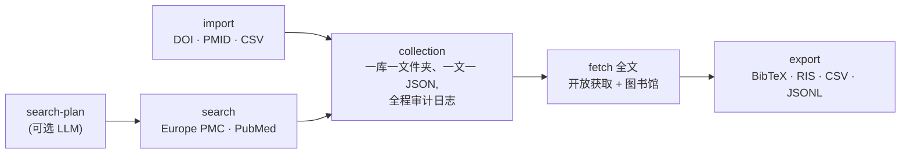

# paper-extract

**面向生物医学 LLM/RAG 的可审计本地文献库工具。**

[](LICENSE)
[](pyproject.toml)
[](tests/)
[](skill/paper-extract/SKILL.md)

[English](README.md) · **中文**

把一条 PubMed / Europe PMC 查询、一份 DOI 列表、一份 PMID 列表或一个 CSV，变成
**本地、可复现的文献收藏库**：元数据、结构化全文 JSON、可选 PDF、引文导出，以及
命令日志。和单纯的 PDF 提取器不同，`paper-extract` 让整条文献工作流**可审计**——
最终产出是一个能直接喂给 LLM/RAG 流水线、系统综述、基金背景调研的数据集，而且每
一篇文献都能追溯到它是怎么进来的。

- **一个收藏库 = 一个本地文件夹**
- **一篇文献 = 一个可读的 `article.json`**（元数据 + 结构化全文）
- **每条命令 = 一条 `logs/*.json` 审计记录**
- **导出 = BibTeX / RIS / CSV / JSONL**（JSONL 可直接用于 RAG）
- **全文 = 开放获取优先**，可选*你自己*的机构访问
- **Agent 即插即用**——内置给 Claude Code / Codex 类 agent 用的 Skill



## 成品长什么样

一条查询进、一个可审计的文件夹出。下面是一次**真实运行**（检索 → 抓开放全文 →
查看状态 → 导出），不是示意：

```console
$ paper-extract search --collection pptp-demo \
    --query 'pediatric preclinical testing program AND "drug response"' --max 8
Europe PMC : 7
PubMed     : 6
overlap    : 0
→ 13 articles added

$ paper-extract fetch --collection pptp-demo --output-format json --access open
Fetching: 13 to fetch, 0 already done (skipped)  [output-format=json, access=open]
  ...
Done. ok=7 fail=6 / 13 attempted (0 already done).

$ paper-extract status --collection pptp-demo
Collection: pptp-demo
Articles: 13
Metadata available: 13
Fulltext available: 7
PDF available: 0
Article kinds: {'research': 9, 'review': 3, 'other': 1}
Quality: {'unknown': 6, 'pass': 6, 'weak': 1}
Sources: {'fulltext:pmc_xml': 7}
Failed/incomplete articles: 6

$ paper-extract collection export --collection pptp-demo --to bib
Wrote export: pptp-demo.bib
```

失败不会被藏起来——有 6 篇没有开放获取全文，这一点会逐篇记录、也会写进 fetch 日
志。之后对它们用 `--access library`，就能通过你自己的机构登录把剩下的补齐。

收藏库就是一堆可读、可 diff、可版本管理的普通文件：

```text
data/collections/pptp-demo/
├── collection.json                       # 收藏库清单
├── articles.csv                          # 一行一篇的索引
├── articles/
│   └── doi_10_3389_fonc_2026_1685447/
│       └── article.json                  # 元数据 + 结构化全文
└── logs/
    ├── search_20260706T061256Z.json      # 审计:搜了什么
    ├── fetch_20260706T061355Z.json       #      抓了哪些全文
    └── status_20260706T061401Z.json      #      收藏库状态随时间变化
```

每个 `article.json` 都为下游抽取做了结构化（真实字段，正文已截断）：

```jsonc
{
  "schema_version": "1.0",
  "article_id": "doi_10_3389_fonc_2026_1685447",
  "identifiers": { "doi": "10.3389/fonc.2026.1685447", "pmid": "41939480", "pmcid": "PMC13046488" },
  "metadata": {
    "title": "ELDA: real-time functional drug profiling in acute lymphoblastic leukemia.",
    "authors": ["Mariano SS", "Assis LHP", "Correa JR", "..."],
    "journal": "Frontiers in oncology",
    "pub_year": 2026,
    "article_kind": "research",
    "is_open_access": true
  },
  "links": {
    "pmc": { "pdf": "https://www.ncbi.nlm.nih.gov/pmc/articles/PMC13046488/pdf/" },
    "publisher": { "page": "https://doi.org/10.3389/fonc.2026.1685447" }
  },
  "sections": { "abstract": "…", "Introduction": "…", "Results": "…", "Discussion": "…" },
  "status": { "metadata": "found", "fulltext": "available", "pdf": "not_started", "llm_extract": "not_started" },
  "source": { "metadata": ["epmc"], "fulltext": "pmc_xml" },
  "quality": { "status": "pass", "body_chars": 50773, "section_count": 12, "issues": [] },
  "updated_at": "2026-07-06T06:13:53Z"
}
```

## 适合谁用

**适合：**

- 批量收集某个课题文献的生信 / 医学研究者。
- 做系统综述、rebuttal、基金背景的人——需要**可追踪、可复现**的文献集合。
- 搭 LLM/RAG 流水线的人——要的是**结构化全文 JSON**，而不是一堆散乱 PDF。
- 有合法**机构图书馆访问权限**、想把自己可访问的全文整理成本地库的研究者。

**不适合：**

- 破解付费墙或绕过身份认证。
- 自动破解验证码。
- 海量下载出版社内容。
- 当通用扫描件 OCR 工具。

`paper-extract` 只使用**你自己的有效账号**、不保存任何凭证，并要求你遵守出版商条
款——见[合理使用](#合理使用)。

## 为什么用 paper-extract

**A. 可复现的文献收藏库。** 一篇文献一个 `article.json`、一个收藏库一个文件夹、
每条命令一条 `logs/*.json`。整套东西都能用普通工具读、diff、版本管理、审计。

**B. 全文优先，不止元数据。** 很多工具止步于引文。`paper-extract` 抓结构化全文
JSON（和可选 PDF），并逐篇做质量检查（`body_chars`、`section_count`、issues），
让你知道实际拿到了什么。

**C. 开放获取 _和_ 你自己的图书馆访问。** 开放获取全自动；订阅内容通过真实浏览器
走你机构的登录（登录一次、批量多篇），**绝不保存你的凭证**；带代理/令牌的链接一律
标记 `sensitive` 并从所有导出中剔除。

**D. 为下游 LLM/RAG 抽取而生。** 重点不是"下载论文"，而是把文献变成 LLM 能可靠
处理的收藏库。JSONL 导出可直接用于 RAG。

**E. 内置 Agent Skill。** 附带 [Skill](skill/paper-extract/SKILL.md)，教 AI 编程
助手（Claude Code、Codex 等）用自然语言驱动整条流水线。

## 安装

### 普通用户

```bash
pip install "paper-extract[browser,pdf,llm] @ git+https://github.com/hfl112/paper-extract.git"
paper-extract --help
```

（去掉 `[browser,pdf,llm]` 就是仅核心安装——检索、开放获取全文、导出都不需要它们。）
PyPI 发布在计划中。

### 开发者

```bash
git clone https://github.com/hfl112/paper-extract.git
cd paper-extract
uv venv --python 3.11                 # 创建 .venv(需要时自动下载 Python)
source .venv/bin/activate             # 重要:先激活!若终端里有激活的 conda 环境,
                                      # 不激活直接 uv pip install 会装进 conda 而不是 .venv
uv pip install ".[browser,pdf,llm,dev]"
paper-extract --help
```

然后把 `.env.example` 复制为 `.env`，按需填写（全部可选，见[配置](#配置)）。

## 快速上手

```bash
# 1. 收集文献(Europe PMC + PubMed)
paper-extract search --collection demo --query 'pediatric preclinical testing program AND "drug response"' --max 20
#    按作者检索:   --query 'AUTH:"Houghton PJ" AND AUTH:"Smith MA"'
#    按标识符导入: paper-extract collection import --collection demo --input-doi 10.1002/pbc.21508

# 2. 抓取全文(开放获取)
paper-extract fetch --collection demo --output-format json --access open

# 3. 查看与导出
paper-extract status --collection demo
paper-extract collection export --collection demo --to bib   # bib | ris | csv | jsonl
```

## 机构 / 图书馆全文

对付费墙文献，`paper-extract` 通过真实浏览器
（[cloakbrowser](https://pypi.org/project/cloakbrowser/)）复用你的高校访问权限。
配置一次，批量抓取：

```bash
paper-extract library login --libkey     # LibKey Nomad 用户(macOS + Chrome)
paper-extract library login              # "Access through your institution"(SSO)
paper-extract fetch --collection demo --output-format both --access library --speed normal
```

工作方式：

- 在弹出的浏览器里**登录一次**，会话对每篇文献复用（走 EZProxy 的
  `login?url=` 表单，自动限速保持礼貌）。
- 浏览器 profile 持久化**稳定的指纹种子**，验证码/挑战通过后的 cookie 在
  login 和 fetch 之间持续有效。
- 交互抓取中若弹出验证码或登录墙，在浏览器窗口里解决即可——工具会轮询页面、
  通过后自动继续。
- 代理域名**从你的会话自动识别**，不绑定任何学校。出版商频繁弹挑战时用
  `--speed normal`/`slow`。

完整决策树与排障见
[`skill/paper-extract/references/library-access.md`](skill/paper-extract/references/library-access.md)。

## Skill（给 AI agent 用）

[`skill/paper-extract/`](skill/paper-extract/) 教 AI 编程助手（Claude Code 等）
何时、如何驱动这个 CLI——包括交互式图书馆登录流程。用
[skillshare](https://github.com/runkids/skillshare) 安装（把 `skill/paper-extract/`
复制进你的 skills 目录后 `skillshare sync`），或直接把 agent 的 skills 目录指过
来。然后用大白话下指令即可：

> *"帮我建一个 PPTP 药物响应相关文献的收藏库,抓开放全文,导出 BibTeX"* ·
> *"这 50 个 DOI 导入,建一个本地 JSONL 语料"* ·
> *"没开放获取的那几篇,走我的图书馆访问"*

## 配置

复制 `.env.example` → `.env`（全部可选）：

| 变量 | 用途 |
|---|---|
| `PAPER_EXTRACT_EMAIL` | Unpaywall / NCBI 礼貌邮箱 |
| `NCBI_API_KEY` | 加速 PubMed / PMC |
| `SPRINGER_OA_API_KEY`、`ELSEVIER_API_KEY`、`WILEY_TDM_TOKEN`、`CORE_API_KEY` | 出版商 OA 全文 |
| `LLM_PROVIDER` + `GEMINI_API_KEY` / `OPENAI_API_KEY` / `DEEPSEEK_API_KEY` / `ANTHROPIC_API_KEY` | LLM 检索规划 |

## 仓库结构

```text
paper_extract/   pyproject.toml   # 引擎(CLI + 库)
llmclient/                        # 供应商无关的 LLM 客户端(随包捆绑)
skill/paper-extract/              # agent Skill(SKILL.md + references)
tests/                            # 离线单元 + 冒烟测试(75 项检查)
```

## 隐私与安全

- 不保存任何账号密码；cookie/令牌绝不写入 `article.json`。
- 带代理/登录的链接标记为 `sensitive`，从所有导出中剔除。
- `data/`、`.env`、cookie、浏览器 profile、扩展均已 gitignore，绝不打包。

## 合理使用

图书馆/机构访问只通过**你自己的有效账号**进行，本工具不绕过任何身份认证。请自行
遵守所在机构的可接受使用政策和各出版商的服务条款（许多条款禁止批量/自动化下载）。
建议使用内置限速（`--speed normal` 或 `slow`），控制批量规模；若出版商反复弹验证，
请停止并降低频率。

## 测试

```bash
uv pip install ".[dev]"
bash tests/run_all.sh        # 28 个单元测试 + 5 组冒烟测试,全部离线
```

## 许可证

[MIT](LICENSE)。
