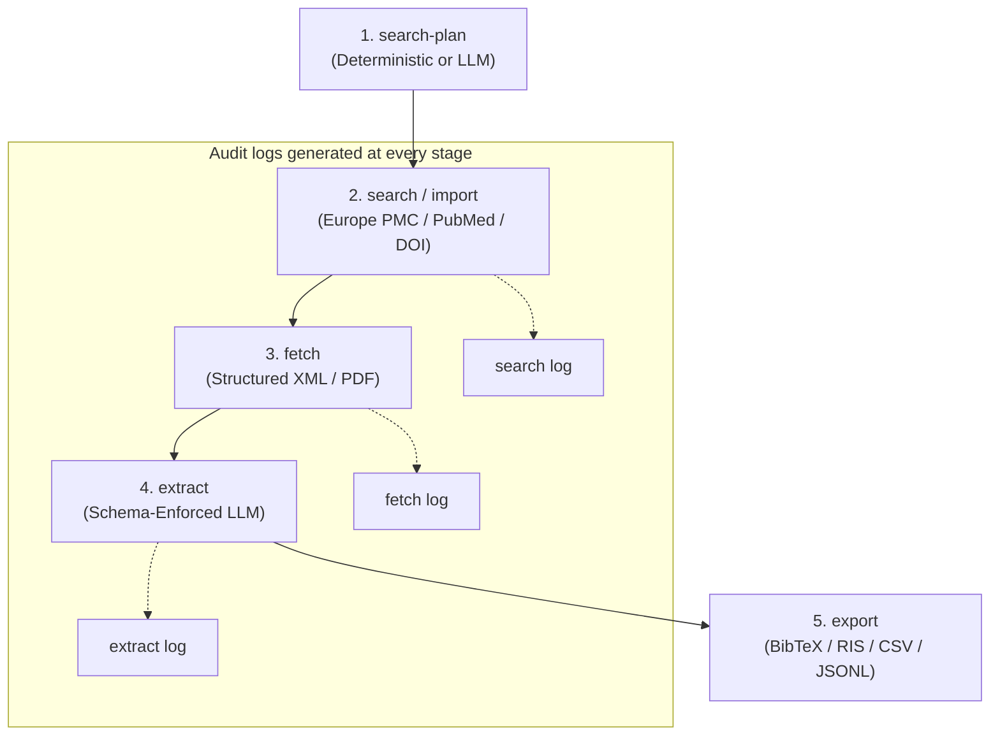
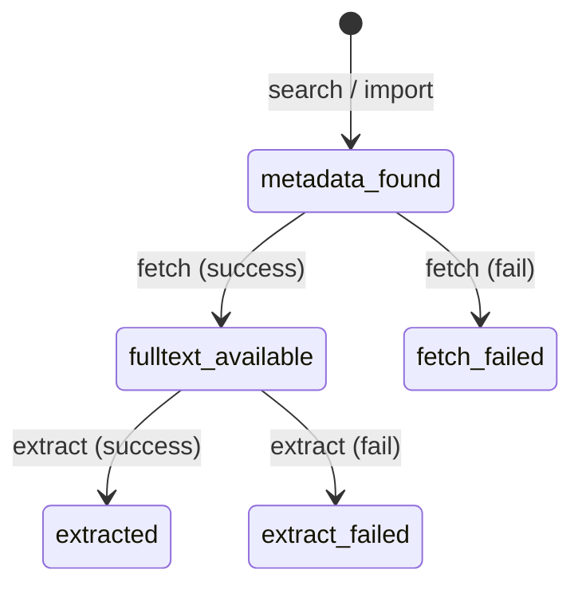

# paper-extract

Drives the `paper-extract` CLI (an installable Python package) to build reproducible, auditable literature collections.

## Glossary

Use these terms exactly — do not substitute with generic words like "dataset," "boundary," or "scraper."

*   **Collection** — A dedicated directory on disk managing a group of papers. Contains a single `collection.json` manifest, an `articles.csv` flat index, and audit logs.
*   **Article JSON** — The single source of truth for an article's data (located at `articles/<article_id>/article.json`), containing metadata, retrieved full-text sections, quality evaluation, and extraction results.
*   **Search-Plan** — A declarative search definition mapping keywords, anchor terms (mandatory concepts), and logical matching criteria.
*   **Fetch** — The retrieval of structured XML/HTML full-text and optional PDFs from open-access sources or institutional libraries.
*   **Extract** — Running an LLM with a schema-enforced specification over retrieved full-text sections to produce a structured record stored in the Article JSON.
*   **Provenance** — Execution metadata (model, spec_id, timestamps, and log IDs) attached to fetched and extracted data to guarantee auditability.
*   **Audit Log** — A timestamped file located in the collection's `logs/` folder recording the exact parameters, inputs, outputs, and failures of every command execution.

## Scope

Use this skill when the user wants to:
- Build a literature collection from a query, DOI/PMID list, or local PDF directory.
- Retrieve paywalled full text via **their own** valid institutional proxy or SSO session.
- Extract structured, open-ended fields from full text using custom specifications.
- Export collections to BibTeX, RIS, CSV, or RAG-ready JSONL format.

Do NOT use this skill to:
- Automatically solve captchas, bypass proxy credentials, or mass-scrape publisher systems.
- Manage Zotero databases directly (exports are strictly local file-based).

---

## Workspace & Data Architecture

An active collection is represented by a strict folder hierarchy. Always locate files within this structure:

```text
data/collections/<collection_name>/
├── collection.json                   # Collection manifest (metadata & articles list)
├── articles.csv                      # Tabular flat index (ID, title, journal, year)
├── articles/
│   └── <article_id>/                 # Article ID = doi_xxx or pmid_xxx
│       ├── article.json              # Source of truth: metadata, sections, and extractions
│       └── article.pdf               # Optional local PDF
└── logs/
    ├── search_<timestamp>.json       # Audit trail for query/import executions
    ├── fetch_<timestamp>.json        # Audit trail for full-text retrievals
    └── status_<timestamp>.json       # Audit trail for collection status reporting
```

---

## Workflow & State Machine

The pipeline operates in sequential stages:



### Article Lifecycle Status
An article's `status` transitions within `article.json` as follows:



---

## Prerequisites

- Verify package installation using: `paper-extract --help` or `uv run paper-extract --help` from the project root.
- Install developer dependencies if missing:
  `uv venv --python 3.11 && source .venv/bin/activate && uv pip install ".[browser,pdf,llm,dev]"`
- Always activate the virtual environment (`.venv`) before running pip to prevent installing into external Conda or system environments.

---

## Command Quick Reference

```bash
# 1. Plan keywords and logical criteria (LLM or deterministic)
paper-extract search-plan --collection demo --keyword "pediatric" --keyword "dasatinib" --anchor "dasatinib" --no-llm

# 2. Execute query search based on the plan
paper-extract search --collection demo --max 30

# 3. Import list of DOIs directly
paper-extract collection import --collection demo --input-doi 10.1002/pbc.21368

# 4. Fetch full text (Always specify --output-format)
paper-extract fetch --collection demo --output-format json --access open

# 5. Extract structured fields using a custom specification
paper-extract extract --collection demo --spec spec.yaml --provider gemini

# 6. Check collection quality and export
paper-extract status --collection demo
paper-extract collection export --collection demo --to jsonl
```

---

## Rules that Matter

- **Required Output Format:** The `--output-format` option (`json` | `pdf` | `both`) is **mandatory** for `fetch`. Never omit it.
- **Section Preference:** Favor structured JSON sections over PDFs. Downstream RAG and LLM tasks must target the clean text body inside `article.json` rather than performing OCR on PDFs.
- **Access Modes (`--access`):**
  - `open`: Retrieves open-access XML/PDFs (Europe PMC / publishers).
  - `library`: Employs interactive browser profiles utilizing user's local proxy.
  - `both`: Attempts open access first, falling back to library credentials.
- **Incremental Runs:** `fetch` and `extract` commands are idempotent. They automatically skip already-completed articles unless the `--force` flag is specified.

---

## Institutional & Library Access Protocol

1.  **Check Readiness:** Always run `paper-extract library doctor` before initiating library fetches.
2.  **Request User Login:** If the doctor reports `NOT READY`, pause execution and instruct the user to run `paper-extract library login` in their terminal.
3.  **Non-Interactive Execution:** Once authorized, run fetches using `--non-interactive` to prevent blocking or hanging in headful browser prompts:
    `paper-extract fetch --collection C --output-format both --access library --non-interactive`
4.  **No Automating Credentials:** Never attempt to prompt the user for password credentials or solve captchas programmatically.

---

## Rejected Framings & Anti-Patterns

*   *Synonym Substitution:* Avoid calling a "Collection" a "Dataset" or "Database". The software relies on strict collection directories.
*   *Zotero Integration:* Do not assume or attempt Zotero synchronization. All exports must write to local files in the current working directory.
*   *Leaking Credentials:* Never surface, export, or check in URLs containing institutional proxy tokens, SSO cookies, or `.env` files.
*   *Hardcoded Extraction Specs:* Do not hardcode extraction fields. The `extract` subcommand must accept open-ended specs from the user.
